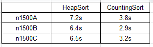

# Kruskal

Resultados Obtidos:

	 
	
       

Dado um gráfico conectado e não direcionado, uma árvore de abrangência desse gráfico é um subgrafo que é uma árvore e conecta todos os vértices. Um único gráfico pode ter muitas árvores de abrangência diferentes. Uma árvore de abrangência mínima (MST) ou uma árvore de abrangência de peso mínimo para um gráfico ponderado, conectado e não direcionado é uma árvore de abrangência com peso menor ou igual ao peso de todas as outras árvores de abrangência. O peso de uma árvore de extensão é a soma dos pesos dados a cada borda da árvore de extensão.

Quantas arestas possui uma árvore de abrangência mínima?
Uma árvore de abrangência mínima possui arestas (V - 1) onde V é o número de vértices no gráfico fornecido.

Quais são as aplicações da Árvore de Abrangência Mínima?
Veja isso para aplicativos do MST.

Abaixo estão as etapas para encontrar o MST usando o algoritmo de Kruskal

1. Classifique todas as arestas na ordem não decrescente do seu peso.
2. Escolha a menor borda. Verifique se ele forma um ciclo com a árvore de abrangência formada até o momento. Se o ciclo não for formado, inclua essa aresta. Senão, descarte-o.
3. Repita a etapa 2 até que haja arestas (V-1) na árvore de abrangência.
